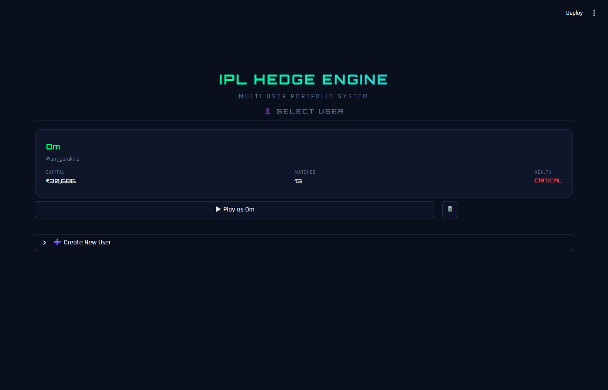
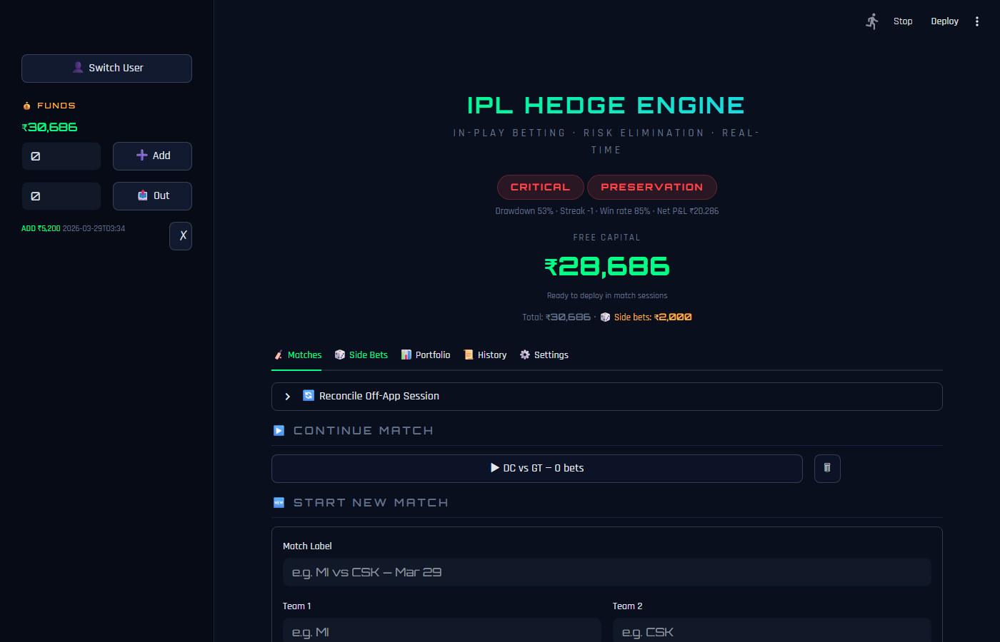
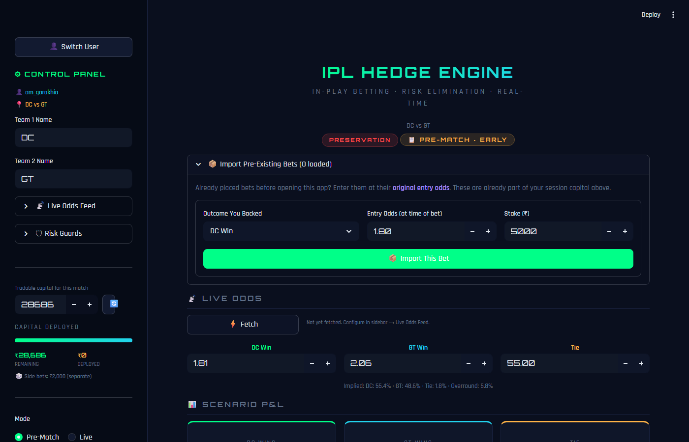
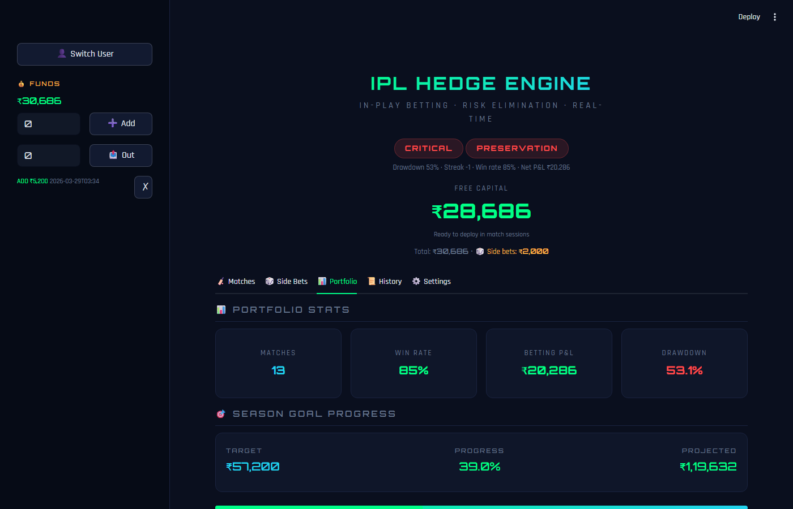
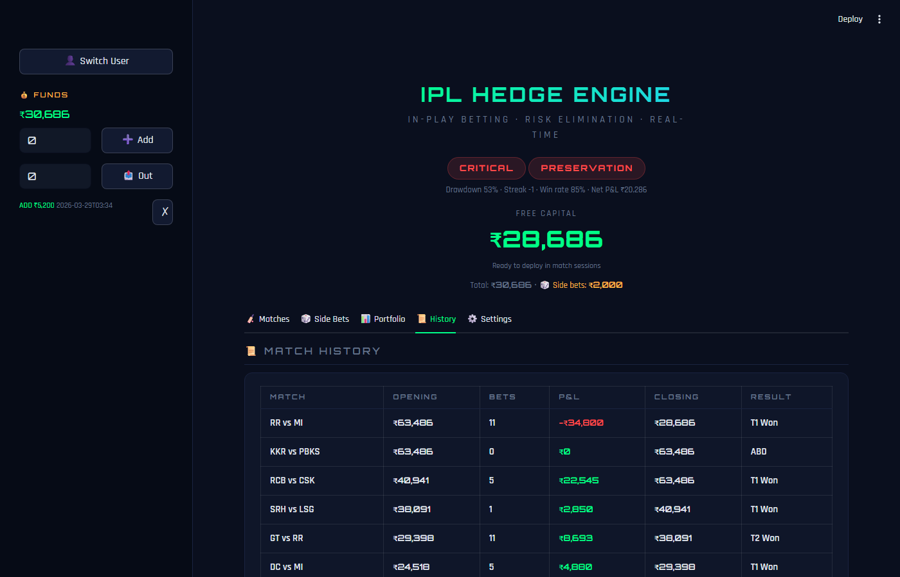

# IPL Bet-It — In-Play Cricket Betting Dashboard

A personal portfolio management and hedge calculation tool for IPL in-play betting. Built with Streamlit, it applies quantitative finance concepts — mean-variance optimisation, Kelly Criterion, linear programming, and Gemini AI — to cricket match betting.

**Live demo:** _(link will be added after Streamlit Cloud deployment)_

---

## What this is

This is a real tool used by the author across 13 IPL matches during the 2026 season, growing a ₹10,400 starting bank to ₹30,685 (+195% net P&L of ₹20,285) as of April 2026.

It is not a tipster app. It does not tell you who will win. What it does is help you manage the bets you have already placed — size hedges mathematically, track your full portfolio, and understand your real-time exposure across all three possible match outcomes (Team 1 Win / Team 2 Win / Tie).

---

## Screenshots

> _Taken from a live session — all figures are real._

### User Select — Landing Screen


### Match Lobby — Capital Overview


### Active Match Session — Live Odds & P&L Matrix


### Portfolio Stats — 13 Matches, 85% Win Rate


### Match History — Full P&L Table


---

## Features

### Core Betting Tools
- **Live Bet Entry** — log bets with time label (E1, M1, D1, etc.), odds, and stake
- **Pre-Match Bets** — separate tracking for bets placed before the toss
- **Side Bets** — track miscellaneous bets (top scorer, fall of wicket, etc.) independently
- **P&L Matrix** — shows your real-time profit/loss for all three match outcomes at all times

### Hedge Solvers (three modes)
| Solver | What it does |
|---|---|
| Optimal Hedge | Minimises worst-case loss across all outcomes using linear programming |
| Conviction Hedge | Minimises hedge cost when you are confident in one result |
| Point of No Return | Eliminates a mathematically impossible outcome from your hedge |

### Portfolio Analytics
- Equity curve with drawdown chart across all 13 matches
- Sharpe/Sortino/Calmar ratio calculations
- VaR (Value at Risk) and Expected Shortfall at 95% confidence
- Match-by-match P&L breakdown
- Capital progression chart (match-by-match opening vs closing)

### Live Odds Integration
- Fetches real-time H2H odds from 10 EU bookmakers via The Odds API
- Computes median odds, overround, and implied probabilities per bookmaker
- Logs odds snapshots over time so you can see odds movement
- Adaptive polling cadence based on match phase (more frequent during death overs)

### AI Strategist (Gemini 2.5 Flash)
- Gives specific, actionable advice referencing your actual bets and capital
- Identifies which bets are LOOKING GOOD / BAD / NEUTRAL
- Will not give generic cricket commentary — every output is decision-focused

### Kelly Criterion Sizing
- Calculates mathematically optimal stake size given your edge and bank
- Half-Kelly and quarter-Kelly options for conservative sizing

### Arbitrage Detection
- Flags when combined implied probabilities across bookmakers fall below 100%
- Shows the guaranteed profit amount if arbitrage is available

### Excel Export
- Full portfolio export to a formatted .xlsx workbook
- Includes bet-by-bet breakdown, settlement history, and aggregate stats

---

## My data (Om Gorakhia)

The repository includes my real betting history (`user_om_gorakhia.json`). When you open the app, select **om_gorakhia** from the user list to see the full picture:

| Stat | Value |
|---|---|
| Starting bank | ₹10,400 |
| Current capital | ₹30,685.98 |
| Net P&L | +₹20,285.98 |
| Return | +195% |
| Matches tracked | 13 |
| Season target | 300% (3x) |

The match history includes bets across RR vs MI, MI vs KKR, CSK vs RCB, and more.

---

## Tech stack

| Layer | Tool |
|---|---|
| UI | Streamlit |
| Charts | Plotly |
| Optimisation | SciPy (linprog) |
| Numerical | NumPy |
| AI | Google Gemini 2.5 Flash |
| Odds data | The Odds API v4 |
| Cricket data | CricAPI |
| Export | OpenPyXL |
| Runtime | Python 3.13 |

---

## Quantitative research modules

The `research/` folder contains standalone scripts that explore the mathematics behind the hedging algorithms:

| Module | Topic |
|---|---|
| `01_mean_variance_hedge.py` | Markowitz portfolio optimisation and efficient frontier |
| `02_risk_adjusted_metrics.py` | Sharpe, Sortino, Calmar ratios on betting equity curve |
| `03_var_es.py` | Value-at-Risk and Expected Shortfall |
| `04_shrinkage.py` | Covariance matrix shrinkage for small sample sizes |
| `05_curse_of_dimensionality.py` | Why the 3-outcome bet problem is well-behaved |
| `06_delta_hedge_analogy.py` | Options Greeks analogy applied to betting positions |
| `07_loocv_backtest.py` | Leave-One-Out Cross-Validation backtesting framework |

---

## Setup

### 1. Clone and install

```bash
git clone https://github.com/om-gorakhia/ipl-bet-it.git
cd ipl-bet-it
pip install -r requirements.txt
```

### 2. API keys (optional — app works without them)

Copy `.env.example` to `.env` and fill in your keys:

```bash
cp .env.example .env
```

| Key | Where to get it | Required for |
|---|---|---|
| `ODDS_API_KEY` | [the-odds-api.com](https://the-odds-api.com) | Live odds fetching |
| `CRICKET_DATA_API_KEY` | [cricapi.com](https://cricapi.com) | Live match state |

The Gemini API key is entered inside the app itself (Settings page) and is stored only in your local user file. You can also set `GEMINI_API_KEY` in your environment.

### 3. Run

```bash
streamlit run ipl_betting_dashboard.py
```

The app opens at `http://localhost:8501`.

---

## Live odds capture (background service)

`data_feed.py` is a separate background service that polls The Odds API and saves snapshots to `captures/`. Run it alongside the dashboard for real-time odds updates:

```bash
# Capture odds for a specific match
python data_feed.py --match "Mumbai" --duration 14400

# Auto-pick the next live IPL match
python data_feed.py --auto --duration 14400

# Test your API connection without writing any files
python data_feed.py --match "Mumbai" --dry-run
```

Captured files are stored as `captures/YYYY-MM-DD__team1__vs__team2.json`. The dashboard reads these automatically.

---

## Data feed configuration

Set these environment variables before running `data_feed.py`:

```bash
export ODDS_API_KEY="your_key"
export CRICKET_DATA_API_KEY="your_key"
```

The Odds API free plan gives 500 requests/month. The poller is adaptive — it slows down pre-match and speeds up during death overs — and stops automatically when fewer than 30 credits remain.

---

## Project structure

```
ipl-bet-it/
├── ipl_betting_dashboard.py   # Main Streamlit app (6,200+ lines)
├── data_feed.py               # Background odds capture service
├── requirements.txt
├── .env.example               # Template for API keys
├── .streamlit/
│   └── config.toml            # Dark theme config
├── user_om_gorakhia.json      # Real betting history (Gemini key removed)
├── users_index.json           # User registry
├── captures/                  # Odds snapshots (JSON, timestamped)
│   └── 2026-04-07__rajasthan_royals__vs__mumbai_indians.json
└── research/                  # Quant research scripts
    ├── 01_mean_variance_hedge.py
    ├── 02_risk_adjusted_metrics.py
    ├── 03_var_es.py
    ├── 04_shrinkage.py
    ├── 05_curse_of_dimensionality.py
    ├── 06_delta_hedge_analogy.py
    └── 07_loocv_backtest.py
```

---

## How hedging works (plain English)

When you back Team 1 to win and then the odds shift in your favour (Team 1 now more likely), you are sitting on an unrealised profit. A hedge is a bet on the other outcome(s) that locks in some of that profit regardless of the final result.

The three solvers in this app answer three different questions:

1. **Optimal hedge** — "What stakes on Team 2 and Tie give me the highest guaranteed floor?" (Uses SciPy `linprog` to solve the linear programme.)
2. **Conviction hedge** — "I still think Team 1 wins. What is the cheapest hedge that eliminates ruin if I am wrong?"
3. **Point of No Return** — "Team 2 is mathematically eliminated at this score. Should I hedge the Tie at all?"

The P&L matrix updates live as you enter bets, so you always see exactly what you gain or lose in each scenario.

---

## Disclaimer

This is a personal project for educational and analytical purposes. Betting involves real financial risk. Nothing in this repository constitutes financial or betting advice. Use at your own discretion.
